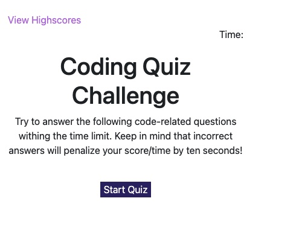

# js-quiz

## Introduction
This was a solo project implemented for UCB Full Stack Bootcamp 2021. The project was to implement a timed quiz on JavaScript fundamentals that stores high scores.

Visit the [live demo](https://wendyqnguyen.github.io/js-quiz/highscores.html)!

## Built With
* HTML
* CSS
* Javascript

## Screenshot

### Deployment

This application is currently deployed on GitHub.

## Contribution
- Wendy Nguyen - [@linkedln](https://www.linkedin.com/in/wenguyen/)

### ©️2021 Wendy Nguyen 
